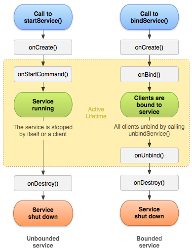

# Android Basic
안드로이드의 기본 개념에 대해 정리하는 공간입니다.
***

# Service

서비스는 백그라운드 작업을 위한 컴포넌트이며 화면과 상관없이 장시간 동안 처리해야 할 업무를 구현할 때 사용됩니다. 다른 앱이 화면을 점유하고 있더라도 앱의 프로세스가 살아서 계속 무언가 작업을 수행해야 할 때 사용하는 컴포넌트 입니다.

서비스 컴포넌트를 이용하는 대표적인 예는 MP3 플레이어 또는 채팅 메신저 등 입니다. MP3 플에이어의 경우 사용자가 화면을 보고 있지 않아도 연결이 끊어지지 않고 계속해서 노래를 들려주어야 하며, 채팅 메신저의 경우 계속 서버와 연결을 유지하여 데이터 통신을 해야하기 때문입니다. **즉, 서비스로 구현하는 경우는 화면과는 전혀 상관이 없지만 앱이 백그라운드에서 무언가를 계속 감지하거나 수행해야 할 업무가 있을 시** 서비스 컴포넌트를 구현하게 됩니다.

### 서비스 구현방법
서비스는 Service 클래스를 상속받아 구현합니다. 컴포넌트인 Service를 상속받아 구현한 것이므로 Manifest에 등록을 해줘야합니다.
```java
// CustomService 작성
public class CustomService extends Service {
    // ...
}

// Manifest 등록
<service android:name=".CustomService"></service>

// 서비스 실행 (startService)
Intent intent = new Intent(this, CustomService.class);
startService(intent);
```

```java
// ServiceConnection 작성
ServiceConnection connection = new ServiceConnection() {
    @Override
    public void onServiceConnection(ComponeneName name, IBinder service) {

    }
    @Override
    public void onServiceDisconnected(ComponentName name) {

    }
}

// 서비스 실행 (bindService)
Intent intent = new Intent(this, BindService.class);
bindService(intent, connection, Context.BIND_AUTO_CREATE);
```
Manifest에 등록시 암시적 인텐트로 수행되게 하려면 <intent-filter>를 서브 태그로 등록해주어야 합니다.  
이렇게 만든 서비스를 실행하는 방법은 2가지가 있는데 `startService(intent)`와 `bindService(intent, connection, Context.BIND_AUTO_CREATE)`입니다. 서비스는 다른 컴포넌트와 다르게 종료 인텐트 발생도 제공해주며 서비스를 종료하는 함수는 `stopService(intent)`와 `unbindService(connection)` 입니다. 두 가지 방법의 차이점에 대해서 알아보겠습니다.

### 서비스 생명주기


#### startService() 함수 이용시 생명주기
startService() 함수로 서비스를 실행시키고 stopService() 함수로 서비스를 종료시킵니다.  
서비스가 startService() 함수로 실행되면 onCreate() -> onStartCommand() 함수가 자동으로 호출되며 Running 상태가 됩니다. 이때 stopService() 함수가 호출되면 onDestroy() 함수가 호출되어 종료됩니다. 여기서 이미 실행되고 있는 서비스를 startService() 함수로 호출하면 onCreate() 함수는 호출되지 않고 onStartCommand() 함수만 한 번 호출됩니다.  
서비스는 액티비티와 다르게 싱글톤으로 동작하는 컴포넌트로 onCreate() 함수는 최초 한 번 호출되는 함수이며 onStartCommand()는 반복 호출이 되는 함수입니다.

#### bindService() 함수 이용시 생명주기
서비스가 bindService() 함수로 시작되면 onCreate() -> onBind() 함수가 호출되며 Running 상태가 됩니다. 이때 unbindService() 함수가 호출되면 unBind() -> onDestroy() 순으로 함수가 호출되며 서비스가 종료됩니다.  
bindService() 함수로 시작된 서비스도 싱글톤으로 구동되며 onCreate()는 한 번만 실행되고 onBind() 함수가 반복적으로 호출되게 됩니다.  
bindService() 함수로 인해 호출되는 onBind() 함수는 다른 생명주기 함수와 다르게 반환값이 있습니다.

```java
@Override
public IBinder onBind(Intent intent) {
    return new MyBinder();
}

class MyBinder extends Binder {
    public void some() {

    }
}
```

onBind() 함수에서 반환할 객체는 Binder를 상속받아 개발자가 만든 클래스의 객체입니다. 이 클래스의 객체를 생성해서 onBind() 함수에서 반환하면 서비스가 bindService() 함수로 실행한 곳에 전달 됩니다. **즉, 함수 이름처럼 서비스가 실행되면서 onBind() 함수에서 반환한 객체가 서비스를 실행한 곳에 바인딩 되는 방법입니다.** onBind() 함수에서 반환한 객체는 bindService() 함수의 매개변수로 지정한 ServiceConnection 구현 객체의 onServiceConnected() 함수의 매개변수로 전달 됩니다.

```java
ServiceConnection connection = new ServiceConnection() {
    /// onBind안의 MyBinder객체가 IBinder service 파라미터로 들어간다.
    @Override
    public void onServiceConnected(ComponeneName name, IBinder service) {

    }
    @Override
    public void onServiceDisconnected(ComponeneName name) {

    }
}
```

bindService() 함수로 실행된 서비스는 자신에게 바인드된 컴포넌트가 하나도 없으면 자동으로 종료됩니다. **즉, 하나의 액티비티가 bindService() 함수로 서비스를 실행한 것이라면 해당 액티비티가 종료되는 시점이나 unbindService() 함수로 종료를 명시하는 시점에 서비스도 함께 종료됩니다.** (여러 액티비티가 bindService()로 서비스를 사용한다면 하나의 액티비티가 종료 되거나 unbindService() 함수를 호출해도 종료되지 않음)

### 데이터 공유

#### startService() 함수로 실행, 브로드캐스트 리시버 이용하기
서비스나 액티비티 내부에 브로드캐스트 리시버를 정의하고, 데이터 전달이 필요할 때 이를 실행하여 브로드캐스트 인텐트에 Extra 데이터로 전달한느 방법을 사용합니다.

```java
// Service 내부의 BroadcastReceiver
// 액티비티로부터 데이터를 받기 위한 Receiver
BroadcastReceiver receiver = new BroadcastReceiver() {
    @Override
    public void onReceive(Context context, Intent intent) {
        String mode = intent.getString("mode");
        if (mode != null) {
            if (mode.equals("start")) {
                // ...
            } else if (mode.equals("stop")) {
                // ...
            }
        }
    }
};

// 서비스 내부에서 BroadcastReceiver 등록 및 해제
@Override
public void onCreate() {
    super.onCreate();
    registerReceiver(receiver, new IntentFilter("toy.david.service.PLAY_TO_SERVICE"));
}

@Override
public void onDestroy() {
    super.onDestroy();
    unregisterReceiver(receiver);
}
```

```java
// Activity 내부의 BroadcastReceiver
// 서비스로부터 데이터르 받기 위한 Receiver

BroadcastReceiver receiver = new BroadcastReceiver() {
    @Override
    public void onReceive(Context context, Intent intent) {
        String mode = intent.getStringExtra("mode");
        if (mode != null) {
            if (mode.equals("start")) {
                // ..
            } else if (mode.equals("stop")) {
                // ..
            }
        }
    }
};

// Activity 내부에서 BroadcastReceiver 등록 및 해제
@Override
protected void onCreate(Bundle saveInstanceState) {
    registerReceiver(receiver, new IntentFilter("toy.david.service.PLAY_TO_ACTIVITY"));
}

@Override
protected void onDestroy() {
    super.onDestroy();
    unregisterReceiver(receiver);
}

@Override
public void onClick(View v) {
    if (v == playBtn) {
        // ...
        Intent intent = new Intent("toy.david.service.PLAY_TO_SERVICE");
        intent.putExtra("mode", "start");
        sendBroadcast(intent);
    }
}

```

### bindService() 함수로 실, 바인드 객체 이용하기
bindService() 함수는 서비스가 실행되면서 **서비스에서 준비한 객체가 액티비티로 바인딩 되는 구조입니다.** 이 바인딩 객체의 함수를 호출하여 함수의 매개변수와 반환값으로 데이터를 주고받는 구조입니다.

### 백그라운드 서비스 제한
Android Oreo 버전부터는 백그라운드 실행 제한이 있습니다. 백그라운드 브로드캐스트 리시버 및 백그라운드 서비스가 대표적입니다. 앱이 포그라운드(foreground)에 있는 경우의 서비스 이용에는 아무런 제약이 없으며 안드로이드에서 판단하는 포그라운드는 다음과 같습니다.

* 액티비티가 시작되거나 일시 중지되거나 상관없이 보이는 액티비티가 있는 경우
* 포그라운드 서비스가 있는 경우
* 앱의 서비스 중 하나에 바인드하거나 앱의 콘텐츠 제공자 중 하나를 사용하여 앱에 또 다른 포그라운드 앱이 연결된 경우

앱의 액티비티가 화면에 보이는 것과 상관없이 **실행 상태이거나 액티비티가 실행되지 않더라도 화면과 관련된 서비스라면 포그라운드로 판단합니다.** 대표적인 예로 알림의 프로그레스바를 지속해서 증감하는 서비스이며 **바인드 방법으로 이용되는 서비스도 포그라운드로 판단합니다.**
