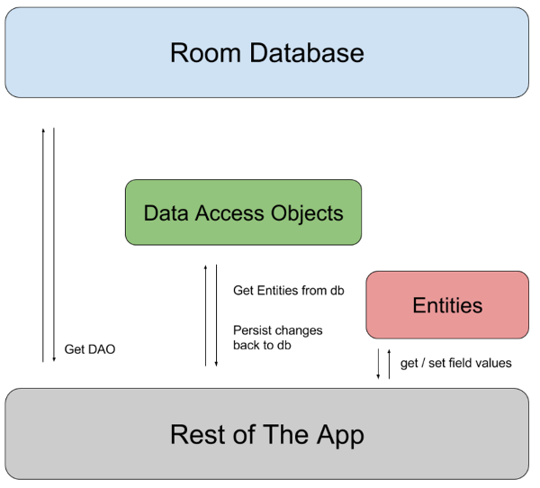

# Room

__Room__ 이란 SQLite의 추상 레이어를 제공하여 SQLite의 객체를 매핑하는 역할을 합니다. 쉽게 말하면 __SQLite의 기능을 모두 사용할 수 있고, DB로의 접근을 편하게 도와주는 라이브러리입니다.__
***

### __Room Components (구성 요소)__

1. `Entity` : Database 안에 있는 테이블을 Java나 Kotlin 클래스로 나타낸 것이며 __데이터 모델 클래스라고 볼 수 있습니다.__

2. `DAO` : Database Access Object, 데이터베이스에 접근해서 __실질적으로 insert, delete 등을 수행하는 메소드를 포함합니다.__

3. `Database` : database holder를 포함하며, 앱에 영구 저장되는 데이터와 기본 연결을 위한 주 액세스 지점이며, __`RoomDatabase`를 extend 하는 추상 클래스여야 하며__, 테이블과 버전을 정의하는 곳입니다.

##### Room Architecture for [Android developers](https://developer.android.com/training/data-storage/room/)

***
### __Entity Data Class 만들기__
Room Database에 사용할 데이터 모델이며 __데이터베이스의 테이블을 표현한다.__ 기본적인 표현은 아래와 같습니다.

##### Entity Data Class
```kotlin
@Entity(tableName = "Users")
data class User (
    @primaryKey val uid: Int,
    @columnInfo(name = 'first_name') val firstName: String?,
    @columnInfo(name = 'last_name') val lastName: String?
)
```
이는 아래와 같이 DB에 Users라는 테이블을 생성하는 정의와 같습니다.

```kotlin
create table Users(
    uid int NOT NULL,
    first_name varchar(255),
    last_name varchar(255),
    PRIMARY KEY (uid)
)
```
Annotation만 외운다면 굉장히 직관적이고 쉽게 사용할 수 있다는 장점이 있습니다. Entity를 생성할 때 tableName을 명시해주지 않으면 __Class Name으로 설정됩니다.__

### __:bulb: Anotation 정보__

__@primaryKey__  
Entity Class에서 __반드시 한개의 필드를 PrimaryKey로 정의해야 합니다.__ 만약 필드가 1개밖에 없더라도 반드시 지정해야 합니다.

__primaryKeys (복합키)__
@Entity(primaryKeys = arrayOf("first_name", "last_name"))

__@CulumnInfo__
테이블에서 __칼럼명을 설정할 수 있습니다.__ 만약 해당 Annotation을 설정하지 않는다면 각 변수명과 동일하게 생성됩니다.

__@Ingnore__
해당 필드는 들어가지 않습니다.

__@ForeignKey__
외래키를 설정할 수 있습니다.

__@Embedded__
중첩 엔터티로 표현할 수 있습니다.

### __DAO(Data Access Object) 만들기__

실질적으로 기능을 수행하는 DAO Class를 생성합니다. Dao는 데이터베이스에 추상적인 접근을 제공하는 메소드들을 포함합니다.

:bulb: Room은 메인쓰레드에서의 데이터베이스 접근을 허용하지 않습니다(허용하는 방법이 있지만 권장하지 않음). 왜냐하면 __만약 데이터를 불러오는 작업이 길어질 경우 UI가 장시간동안 멈춰버릴 수 있기 때문입니다.__ 그래서 데이터를 불러올 때는 비동기적으로 호출을 해야 합니다.

##### __UserDao Class__
```kotlin
@Dao
interface UserDao {
    @Insert(onConflict = OnConflictStrategy.REPLACE)
    fun insertUsers(vararg users: User)

    @Delete
    fun deleteUsers(vararg users: User)

    @Update
    fun updateUsers(vararg users: User)

    @Query("SELECT * FROM user")
    fun loadAllUsers() : List<User>

    @Qeury("SELECT * FROM user WHERE first_name = :firstName")
    fun loadAllUsersSameFirstName(firstName: String) : List<User>
}
```
### __:bulb: Anotation 정보__

__@Insert(onConflict = ...)__
onConflict Annotation은 PrimaryKey가 중복될 때 어떻게 처리할지에 대해서 명시해 줍니다. 예제에서 REPLACE는 대체되게 됩니다.

만약 @Insert 메소드가 __하나의 파라미터만 받는다면, 삽입한 데이터에 대한 long형 rowId를 리턴__ 받을 수 있습니다. 만약 __파라미터가 여러개라면 long[] 또는 List<Long>으로 대신 리턴__ 받을 수 있습니다.

__@Delete__
PrimaryKey가 매칭되는 데이터를 삭제합니다. 필요시 리턴값을 받을 수 있으며 __삭제된 행의 개수를 Int형으로 반환__ 합니다.

__@Update__
PrimaryKey가 매칭되는 데이터를 업데이트 합니다. 필요시 리턴값을 받을 수 있으며 __수정된 행의 개수를 Int형으로 리턴__ 합니다.

__@Query__
일반적인 쿼리문을 작성할 수 있으며 필요에 따라 복잡한 형태의 쿼리도 가능합니다. 이 경우 함수에서 인자로 받은 파라미터를 클론(:)과 함께 쿼리에 넣어줄 수 있습니다.

### __Database Class 만들기__

데이터베이스 생성을 위한 추상클래스를 만들어줍니다. __만약 SQL에서 지원하는 데이터 포맷이 아닌 다른 값(CustomClass, List, LocalDate 등)이 포함되어 있다면 Converter Class를 만들고 @TypeConverter Annotation을 이용하여 명시해줘야 합니다.__

```kotlin
@Database(entities = [(User::class)], version = 1)
abstract class UserDatabase : RoomDatabase() {
    abstract fun UserDao(): userDao

    companion object {
        private var INSTANCE: UserDatabase? = null

        fun getInstance(context: Context) : UserDatabase {
            if (INSTANCE == null) {
                synchronized(UserDatabase::class) {
                    INSTANCE = Room.databaseBuilder(
                        context,
                        UserDatabase::class.java,
                        "Sample.db"
                    )
                    .build()
                }
            }
            return INSTANCE!!
        }
    }
}
```

Database를 생성하는 코드는 비용이 많이 들기 때문에 Singletone으로 구현 하는 것이 좋습니다.

### __Room 사용하기 예제__

```kotlin
database.userDao().insertUsers(users)

val users = database.userDao().loadAllUsers()
val sameFirstNameUsers = database.userDao().loadAllUsersSameFirstName()
```

***

# Reference

* [해리의 유목코딩](https://medium.com/harrythegreat/android-room-database-%EC%8B%9C%EC%9E%91%ED%95%98%EA%B8%B0-f2019cdced0c)

* [찰스의 안드로이드](https://www.charlezz.com/?p=368)
