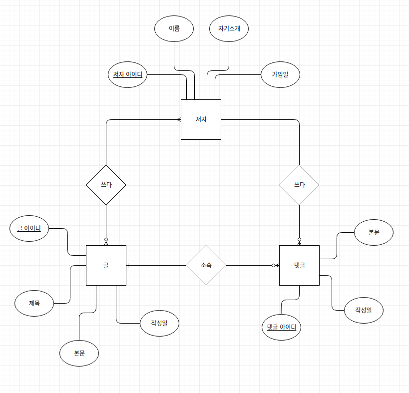

# __관계형 데이터 모델링(RDB)__

**업무파악** -> **개념적 데이터 모델링** -> **논리적 데이터 모델링** -> **물리적 데이터 모델링**

***

# __업무 파악__
어떤 것을 꿈꾸고 있는지, 어떤 결과물을 만들어내고 싶은지를 파악하는 단계 (기획서 또는 UI)
* 원하는 결과물을 함께 고민하고 그려가며 UI를 설계해본다.
* 서로 고민하며 원하는 결과물을 구체화시킬 수 있다.

__@TODO__
__원하는 결과물을 기획하기__
[ovenapp](https://ovenapp.io/)을 이용해 결과물을 만들어보기

***

# __개념적 데이터 모델링__
내가 하고자 하는 일이 어떠한 개념들을 가지고 있고 상호작용하고 있는지 생각하는 단계  
이 과정에서 ER-다이어그램을 뽑아낼 수 있다.

* 현실에서 개념을 추출하는 일종의 **필터**를 제공한다.
* 개념에 대해서 다른사람들과 대화할 수 있게 해주는 일종의 언어로서 작용하게 된다.
* 이를 이루게 해주는 것이 **Entity Relationship Diagram(ERD)** 이다.

> 포함적인 관계가 아닌 평면적인 관계로 개념을 뽑아낸다.

## __Entity Relationship Diagram__
현실을 3가지 관점으로 간단하게 바라볼 수 있는 **Finder와 같은 역할을 한다.** 현실로부터 개념을 인식하는 도구 이면서 다른사람도 알아볼 수 있게 해줄 수 있게 해준다. **또한 매우 쉽게 표로 전환할 수 있다.**

#### __ERD의 3가지 관점__
1. 정보 - 정보를 발견하고 다른사람에게 표현할 수 있게 해준다.
2. 그룹 - 서로 연관된 정보를 그룹핑해서 인식하고 다른사람에게 표현할 수 있게 해준다.
3. 정보 그룹사이의 관계를 인식하고 다른사람에게 표현할 수 있게 해준다.

#### __ERD를 만드는 방법__
1. 서로 연관된 정보들을 묶어주는 큰 덩어리부터 뽑아낸다. (ex. 글, 저자, 댓글 등)
2. 글, 저자, 댓글 들을 모두 동등하게 표현한다.
3. 표 안에 표가 내포되어 있는 관계는 허용하지 않는다.

__[표 1. 거대 단일 테이블]__

|글 제목|글 내용|글 저자 이름|글 저자 소개|글 저자 가입일|댓글 내용|댓글 저자|댓글 저자 소개|댓글 저자 가입일|
|:---:|:---:|:---:|:---:|:---:|:---:|:---:|:---:|:---:|
|글 1 제목|글 1 내용|
저자 1 이름|
저자 1 소개|
저자 1 가입일|댓글 1 내용|
저자 1 이름|
저자 1 소개|
저자 1 가입일|
|글 2 제목|글 2 내용|
저자 1 이름|
저자 1 소개|
저자 1 가입일|댓글 2 내용|
저자 1 이름|
저자 1 소개|
저자 1 가입일|
|글 3 제목|글 3 내용|
저자 2 이름|
저자 2 소개|
저자 2 가입일|댓글 3 내용|
저자 3 이름|
저자 3 소개|
저자 3 가입일|

**표 1**과 같이 하나의 표 안에 모든 정보를 다 담을 수도 있다. 즉 여러개의 컬럼(Column)을 가진 표를 만들 수 있다. **하지만** 극단적으로 1천개의 컬럼이 필요한 표를 만들었을 때 불필요한 정보를 불러올 수 있다. 또한 1억개의 데이터가 있다면 **데이터의 중복이 발생**하게 된다. 즉, **거대 단일 테이블로 표현하면 데이터를 다룰 때 효율이 떨어지고 중복이 발생한다.** 이러한 중복을 최소화 하기 위해 아래와 같이 표를 나눈다.

__[표 2. 글 테이블]__

|아이디|제목|내용|저자 아이디|
|:---:|:---:|:---:|:---:|
|1|제목 1|내용 1|1|
|2|제목 2|내용 2|1|
|3|제목 3|내용 3|1|

__[표 3. 저자 테이블]__

|아이디|이름|소개|
|:---:|:---:|:---:|
|1|이름 1|소개 1|
|2|이름 2|소개 2|
|3|이름 3|소개 3|

__[표 4. 댓글 테이블]__

|아이디|제목|내용|작성일|저자 아이디|
|:---:|:---:|:---:|:---:|:---:|
|1|제목 1|내용 1|작성일 1|1|
|2|제목 2|내용 2|작성일 2|1|
|3|제목 3|내용 3|작성일 3|2|

**위와 같이 테이블을 여러개로 쪼갰을 때의 이점**
1. 주제에 따라서 데이터를 **그룹핑**할 수 있다.
2. 필요한 정보만을 뽑아낼 수 있다.
3. **Join**을 사용하여 아래 [표 5]와 같이 **관계된 테이블을 합성**하여 뽑아낼 수 있다.

> **SELECT** 댓글, 내용, 댓글.작성일, 저자.이름, 저자.소개
**FROM** 댓글 **LEFT JOIN** 저자 **ON** 댓글.저자 아이디 = 저자.아이디

__[표 5. Join 결과]__

|댓글 내용|댓글 작성일|저자|저자 소개|
|:---:|:---:|:---:|:---:|
|댓글 1 내용|댓글 1 작성일|
저자 1 이름|
저자 1 자기소개|
|댓글 2 내용|댓글 2 작성일|
저자 1 이름|
저자 1 자기소개|
|댓글 3 내용|댓글 3 작성일|
저자 1 이름|
저자 1 자기소개|

> 포함적인 관계가 아닌 평면적인 관계로 개념을 뽑아낸다.

### __ERD 에서의 표현__
#### __Entity - Table__
찾아낸 **개념을 Entity**라고 말하며 추후 Table로 전환이 된다.

    개념 : 글, 저자, 댓글 등

#### __Attribute - column__
개념안에 있는 **구체적인 데이터**를 말하며 추후 Table의 Column이 된다.

    구체적 데이터 : 글(개념)의 제목, 본문, 생성일 등

Entity를 Directory라고 생각하고 Attribute를 File이라고 한다면  Entity는 Child Directory를 가질 수 없는 **평면적인 Directory**라고 생각하면 된다.

#### __Relation - PK, FK__
**Entity들 간의 연관성을 표현**해 준 것을 Relation 이라고 하며 PK, FK의 형태로 관계가 표현이 되며 **Join을 통해 테이블들을 연결**한다.

    저자 --- <쓰다> --- 글
    글 --- <소속> --- 댓글
    저자 --- <쓰다> --- 댓글

***
## **Entity 정의**
**읽기**에서는 Entity를 찾기가 힘들고 **쓰기**에서는 대체적으로 찾기 쉽다. 즉, 예제에서 살펴보면 **저자등록, 글 작성, 댓글 작성** 등이 쓰기에 해당한다.

__~~@TODO~~__
__~~ER-Diagram 그려보기~~__
~~[draw.io](https://www.draw.io)를 이용해 ER-Dialgram 그려보기~~

## **각 Entity에서 속성 뽑아내기**
* 글 - 제목, 작성일, 본문
* 저자 - 이름, 자기소개, 가입일
* 댓글 - 본문, 작성일

각 Entity의 속성들을 정의 했다면 식별자(Identifier)를 설정해줘야 한다. **식별자란 해당 Entity의 Raw를 나타내는 고유 속성**이며 추후 PrimaryKey가 된다.

**식별자로 사용될 수 있는 Column**
중복이 발생할 수 없는 속성(Column)을 식별자로 선정해야 한다.

* 후보키(candidate key) - 식별자가 될 수 있는 key들
* 기본키(primary key) - 후보키 중에서 선정한 식별자
* 대체키(alternate key) - 기본키가 아닌 후보키들 (성능향상을 위해서 secondary index를 걸기 좋은 key)
* 중복키(composite key) - 두개의 key를 합쳐 기본키로 설정함

식별자를 선정하기 위해 각 Entity에 Primary Key가 될 수 있는 속성을 추가함.

* 글 - **글 아이디(auto increasement)**, 제목, 작성일 본문
* 저자 - **저자 아이디(auto increasement)**, 자기소개, 가입일
* 댓글 - **댓글 아이디(auto increasement)**, 본문, 작성일

***
## **Relationship 정의**
각 테이블들의 **PrimaryKey와 ForeignKey가 연결**되는 걸 통해서 실제로 구현이 된다.

    PrimaryKey - 각 테이블의 Raw를 식별하는 유일무일한 식별자
    ForeignKey - 다른 테이블의 PrimaryKey와 연결되어 있는 식별자

### __Cardinality와 Optionality__

**Cardinality**
ERD에서 데이터베이스가 지켜야할 제약조건 중 연결(Connectivity)를 나타내는 것

    일대일(One To On, 1:1) - X에 속하는 한 개체는 Y에 속하는 한 개체에만 연결되며, Y에 속하는 한 개체도 X에 속하는 한 개체에만 연결된다.(ex. 담임 - 반)
    일대다(One To Many, 1:N) - X에 속하는 한 개체는 Y에 속하는 한 개체에만 연결되며, Y에 속하는 한 개체는 X에 속하는 여러 개체들과 연결된다. (ex. 저자 - 댓글)
    다대다(Many To Many, N:M) - X에 속하는 한 개체는 Y에 속하는 여러 개체들과 연결될 수 있으며, Y에 속하는 한 개체도 X에 속하는 여러 개체들과 연결될 수 있다. (ex. 글 - 저자 (공동 저자))

__Optionality__
ERD에서 두 테이블간 필수관계(Mandatory)와 선택관계(Optional)를 나타내는 것

    Ex) 저자 - 댓글간의 관계
    저자의 관점 - 저자는 댓글을 작성하지 않을수도 있다.
    댓글의 관점 - 각 댓글은 반드시 저자가 있다.

    표현 (ㅁ - 테이블)
    ㅁ--|-----O--ㅁ

## __ER-Diagram__

# __논리적 데이터 모델링__
생각한 개념들을 관계형 데이터 베이스 패러다임에 맞는 표로 전환하는 작업

## __Mapping Rule__
ERD를 통해 표현한 내용을 관계형 데이터 베이스에 맞는 형식을로 전환할 때 사용하는 방법론

    Entity -> Table
    Attribute -> Column
    Relation -> PK, FK

@TODO ER Master 도구 사용해보기 (ermater.sourceforge.net)

## __Relationship -> PK, FK__

* __1:1 관계 (저자 - 휴면저자)__
의존 관계에 따라 PK, FK를 따질 수 있음.  
**저자는 휴면저자에 의존하지 않지만 휴면저자는 저자에 의존함.** 따라서 저자 테이블에 PK를 배치하고 휴면저자 테이블에 FK를 배치한다.  

* __1:N 관계 (댓글 - 저자, 댓글 - 글)__
1:N 관계에서는 N인 쪽이 FK를 가지면 된다.

* __N:M 관계 (저자 - 글)__

__예제__

__:book: 저자 및 작성글 현황__

| 저자 | 작성 글     |
| :------------- | :------------- |
| kim       | MySQL, SQL Server, ORACLE       |
| lee       | MySQL, SQL Server       |

__:seedling: author 테이블__

| id | name | profile | created |
|:---:|:---:|:---:|:---:|
|1|kim|developer|2011|
|2|lee|designer|2012|
|3|park|planner|2013|

__:seedling: topic 테이블__

| id | title | description | created |
|:---:|:---:|:---:|:---:|
|1|MySQL ... |...|2011|
|2|ORACLE ... |...|2012|
|3|SQL Server ... |...|2013|

위와 같은 **N : M 관계인 두 테이블에서** PK, FK를 설정해야한다. 만약 **topic에 author 정보를 적는다면 아래와 같이 만들어 진다.**

__:seedling: author 정보를 기입한 topic 테이블__

| id | title | description | created |author_id|
|:---:|:---:|:---:|:---:|:---:|
|1|MySQL ... |...|2011|1,2|
|2|ORACLE ... |...|2012||
|3|SQL Server ... |...|2013|1,2|

**하지만** 이렇게 만드는 경우 **두 테이블간 JOIN을 할 수 없을 뿐더러 검색할 때 많은 제약사항이 생긴다.** author테이블에 topic정보를 기입할 때에도 마찬가지이다. **이를 해결하기 위해서 중재자인 Mapping Table을 따로 만든다.**

## __Mapping Table__
**author 테이블**과 **topic 테이블**의 사이를 이어주는 Mapping Table인 **Write 테이블**을 만든다.

**:seedling: write 테이블 (Mapping Table)**

|author_id|topic_id|created|
|:---:|:---:|:---:|
|1|1|...|
|1|2|...|
|1|3|...|
|2|1|...|
|2|3|...|

Mapping Table을 작성하게 되면 두 테이블이 결합되었을 때 의미가 있는 정보 (ex. 각 저자가 언제 글을 수정하였는 가 등의 정보)를 알 수 있게 된다.

@TODO ER Master 도구 사용해 N:M 관계까지 모두 그려보기

## __정규화 (Normalization)__
정제되지 않은 데이터(표)를 관계형 데이터 베이스에 어울리는 표로 만들어주는 레시피이다.

### __예제__
Unnormalized Form에서부터 제 1 정규화, 제 2 정규화, 제 3 정규화를 거쳐가면서 관계형 데이터베이스에 걸맞는 표로 만들어가기.

__:seedling: Unnormalized Form__
관계형 데이터베이스에 맞지 않는 상태

|<U>title</U>|<U>type</U>|description|created|author_id|author_name|author_profile|price|tag|
|:---:|:---:|:---:|:---:|:---:|:---:|:---:|:---:|:---:|
|MySQL|paper|MySQL is ... |2011|1|kim|developer|10000|rdb, free|
|MySQL|online|MySQL is ... |2011|1|kim|developer|0|rdb, free|
|ORACLE|online|ORACLE is ... |2012|1|kim|developer|0|rdb, commercial|

## __제 1 정규화(First Normal Form)__
원칙 : **Atomic columns**  
각 행의 컬럼 값들이 Atomic 해야한다. (각각의 컬럼이 하나의 값만을 가져야 한다.)

> 만약 해당 컬럼이 여러개의 값을 가져도 된다면 정규화를 진행할 필요가 없다.

__잘못된 제 1 정규화의 예__

|<U>title</U>|<U>type</U>|description|created|author_id|author_name|author_profile|price|tag|
|:---:|:---:|:---:|:---:|:---:|:---:|:---:|:---:|:---:|
|MySQL|paper|MySQL is ... |2011|1|kim|developer|10000|rdb|
|MySQL|paper|MySQL is ... |2011|1|kim|developer|10000|free|

제 1 정규화를 만족하지만 **데이터의 중복이 일어나고 있음.**

|<U>title</U>|<U>type</U>|description|created|author_id|author_name|author_profile|price|tag1|tag2|
|:---:|:---:|:---:|:---:|:---:|:---:|:---:|:---:|:---:|:---:|
|MySQL|paper|MySQL is ... |2011|1|kim|developer|10000|rdb|free|

제 1 정규화를 만족하지만 **만약 tag를 추가한다면 테이블 전체 구조를 변경하거나 낭비(null)가 생긴다.**

> **제 1 정규화를 만족하면서 데이터를 효율적으로 다루기 위해 테이블을 쪼갠다.**

__:seedling: 테이블 쪼개기__

    Topic -N-------M- Tag (N : M 관계)
    따라서 Mapping Table을 만들어야 함

tag는 글의 type과는 관계 없이 **글의 제목(title)에만 의존하고 있다.** 따라서 **topic의 중복키 중 title만을 PK로 가져온다.** 또한 topic과 tag를 mapping하므로 tag의 id값을 가져와 Mapping Table의 PK를 만든다.

__topic Table__

|<U>title</U>|<U>type</U>|description|created|author_id|author_name|author_profile|price|
|:---:|:---:|:---:|:---:|:---:|:---:|:---:|:---:|
|MySQL|paper|MySQL is ... |2011|1|kim|developer|10000|

__topic_tag_relation (Mapping Table)__

|<U>topic_title</U>|<U>tag_id</U>|
|:---:|:---:|
|MySQL|1|
|MySQL|2|
|ORACLE|1|
|ORACLE|3|

__tag Table__

|tag|name|
|:---:|:---:|
|1|rdb|
|2|free|
|3|commercial|

# __물리적 데이터 모델링__
어떤 데이터베이스를 사용할 것인지 생각하는 단계  
표를 생성하는 SQL코드를 산출할 수 있다.
